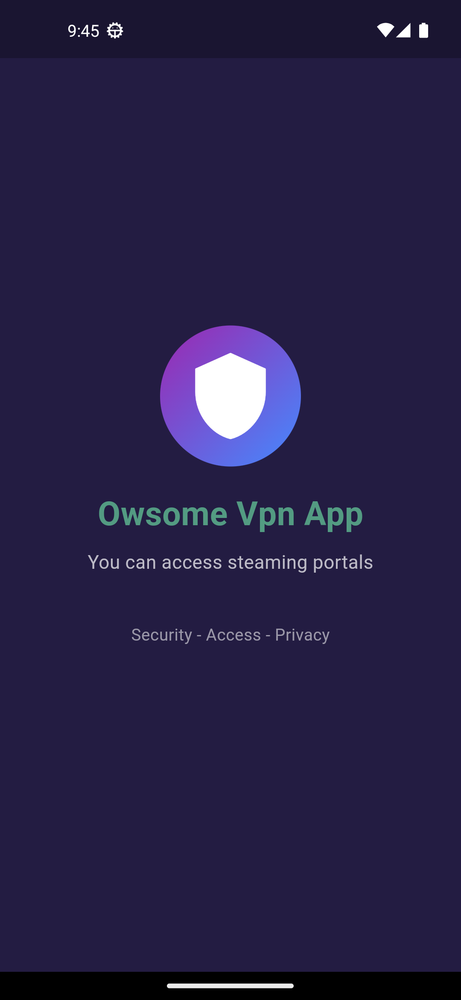

# Awesome Vpn App

**Awesome Vpn** is a secure, user-friendly mobile VPN application that allows users to connect to VPN servers worldwide. Built with Flutter and integrated with OpenVPN, this app ensures fast, reliable, and private internet access.

---

## Features

- **Secure VPN Connections**: Powered by OpenVPN protocol for high security.
- **Global Servers**: Choose from multiple server locations worldwide.
- **Real-time VPN Status**: View connection statistics such as data usage, connection duration, and last packet received.
- **Network Conditions**: Intuitive network icons represent connection quality based on ping.
- **Country-specific Server Selection**: Easily choose servers by country, complete with country flag, IP, and ping display.
- **Single Expansion for Server List**: View only one expanded country at a time to keep the interface organized.

### Screenshots




---

## Tech Stack

- **Flutter**: Cross-platform mobile framework
- **OpenVPN**: Secure VPN protocol
- **GetX**: State management and routing
- **AdMob**: Integrated with banner ads for monetization

---

## Project Structure

- **lib/controllers**: Contains controllers for managing app state (e.g., `HomeController`)
- **lib/models**: Defines models like `VpnStatus` to track connection data
- **lib/views**: UI components and screens (e.g., `SelectServerIpScreen`)
- **lib/widgets**: Reusable widgets (e.g., for network condition icons and server lists)
- **assets/images**: Network level and flag icons for UI representation

---

## Installation

1. Clone this repository:
   ```bash
   git clone https://github.com/yourusername/awesome-vpn.git
   ```
